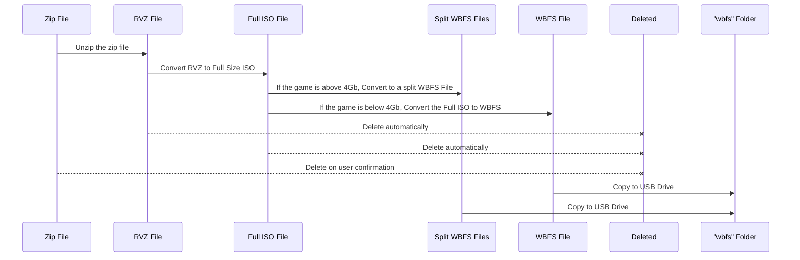
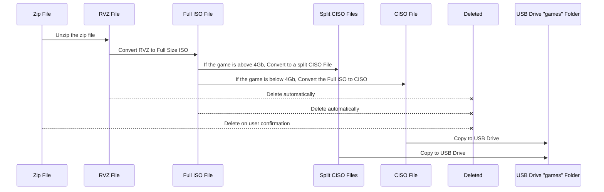

# WiiBackupCliTools

## Disclaimer
This software doesn't help you obtain Wii or GameCube Software, this will be up to yourself to source from your own legally obtained backups which may or may not be illegal in your country, this software comes with no warranty or even a guarantee that it will work!

>
> It worked for me
>
> I am not responsible for what you do with this software.
>

That being said please read the instructions.

## What do?
These two python scripts were written to automate the conversion process from compressed RVZ format to a format that can be used on real Wii & vWii hardware via a USB loader such as USB Loader GX or WiiFlow, just drop all your ZIP/RVZ Files in a folder, run one of the applicable scripts and it will convert Wii to WBFS files and GameCube to CISO ready for placement on a FAT32 USB Drive, you can use NTFS or EXFAT but Nintendont, USB Loader GX and WiiFlow can all use FAT32.

## Why?
Say you have your *legally* backed up games on a server or a spare USB drive ("Just-in-Case") but to save space you converted the full size ISO files into RVZ Format then zipped that rvz to save more space... Manually, you'd have to do the conversion all yourself as below.

To speed things up, I created this set of tools that will do all that busy work for you.

### Wii Conversion Process



### GameCube Conversion Process



## How start?

### Dependencies

These scripts rely on a few cli tools to be preinstalled on your system:

- [Wiimms ISO tools](https://wit.wiimm.de/wit/)
- [Dolphin Emu Tools](https://github.com/dolphin-emu/dolphin?tab=readme-ov-file#dolphintool-usage)
- [Unzip](https://linux.die.net/man/1/unzip) (usually preinstalled)
- [Python 3](https://www.python.org/downloads/) (usually preinstalled)

### Get the repo and move into the directory
```sh
git clone https://github.com/mowglixx/WiiBackupCliTools.git
cd WiiBackupCliTools
```

### Copy the scripts to a PATH location of your choice
#### Default: '~/.local/bin/'
```sh
cp wii.convertToWbfs ~/.local/bin/
cp gc.convertToCiso ~/.local/bin/
```

### Go to said location and make the scripts executable
```sh
cd ~/.local/bin
chmod +x wii.convertToWbfs
chmod +x gc.convertToCiso
```

### Convert your Wii games
```sh
# Example dir
## Example contents
##  - ~/wii/backups/
##    - Game 1.zip
##    - Game 2.zip
##    - Game 3.zip
$ cd ~/wii/backups/
$ wii.convertToWbfs
```
### Convert your GameCube games
```sh
# Example dir
## Example contents
##  - ~/gc/backups/
##    - Game 1.zip
##    - Game 2.zip
##    - Game 3.zip
$ cd ~/gc/backups/
$ gc.convertToCiso
```

### Copy to USB

I won't guide you through this but there are plenty of guides online, Good Luck 👌